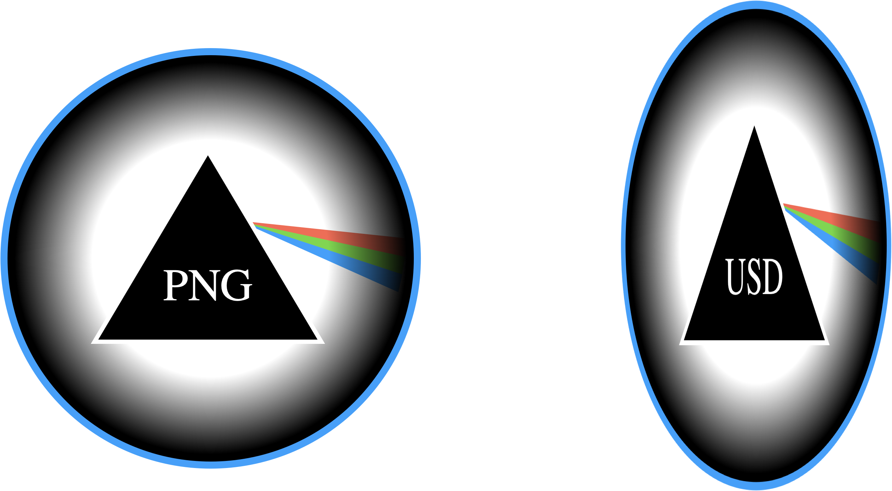

# PNG2USD

works when executing from the blender path:
`/Applications/Blender.app/Contents/MacOS/Blender --python "/Users/davidrug/Library/Mobile Documents/iCloud~md~obsidian/Documents/InterBrain/PNG2USD/png2usd.py"`

pain points:
- blender GUI opens unnecessarily
- cube is added
- requires complicated command to execute (see above)
  
claude chat: https://claude.ai/chat/31490a6c-6e1c-499b-a8bb-4867dabae8d6
